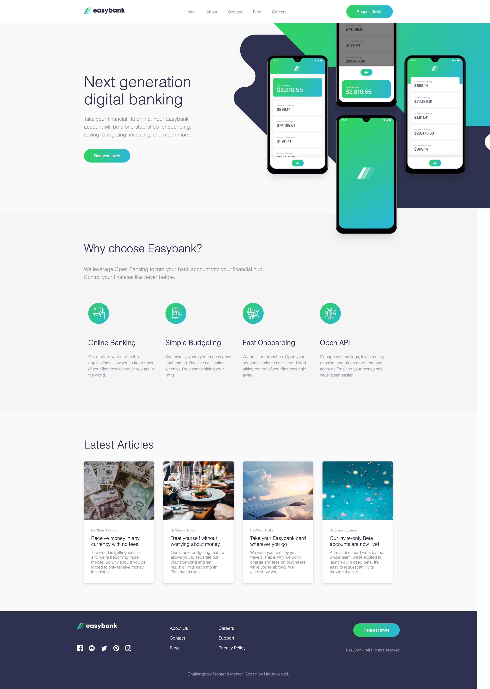

# Frontend Mentor - Easybank landing page solution

This is a solution to the [Easybank landing page challenge on Frontend Mentor](https://www.frontendmentor.io/challenges/easybank-landing-page-WaUhkoDN). Frontend Mentor challenges help you improve your coding skills by building realistic projects.

## Table of contents

- [Overview](#overview)
  - [The challenge](#the-challenge)
  - [Screenshot](#screenshot)
  - [Links](#links)
- [My process](#my-process)
  - [Built with](#built-with)
  - [What I learned](#what-i-learned)
  - [Continued development](#continued-development)
  - [Useful resources](#useful-resources)
- [Author](#author)
- [Acknowledgments](#acknowledgments)

## Overview

### The challenge

Users should be able to:

- View the optimal layout for the site depending on their device's screen size
- See hover states for all interactive elements on the page

### Screenshot

### Links

- Solution URL: [Solution GitHub Repo](https://github.com/harunjonuzi/FeM-harunj-easybank)
- Live Site URL: [Solution Live View](https://harunjonuzi.github.io/FeM-harunj-easybank/)

## My process

### Built with

- Semantic HTML5 markup
- Sass
- Flexbox
- CSS Grid
- Mobile-first workflow

### What I learned

I learned alot about Sass and Grid.

### Continued development

In the future I want to be able to fix an issue which is caused when in mobile view, opening the menu and then resizing to Desktop view, there is a weird bug happening there but as soon as I learn more about JavaScript I will be able to fix it.

## Author

- Website - [Harun Jonuzi](https://www.harunjonuzi.com)
- GitHub - [@harunjonuzi](https://www.github.com/harunjonuzi)
- Frontend Mentor - [@harunjonuzi](https://www.frontendmentor.io/profile/harunjonuzi)
- Twitter - [@harunjonuzi](https://www.twitter.com/harunjonuzi)
